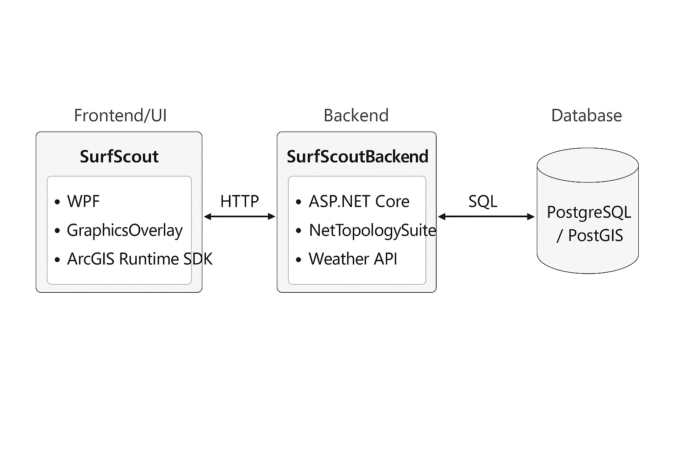
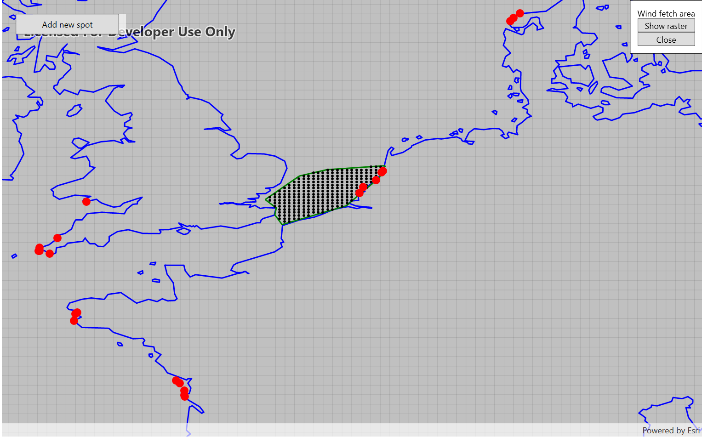

# SurfScout 🌬️🏄‍♂️

This project was the prototype and MVP designed to evaluate windfield data.

## 🔍 Project Goals

- Collect and visualize wind data (raster points) around surf spots and validate the stored data
- Compare weather forecasts with actual conditions and assess accuracy
- Evaluate tide levels
- Determine the **most accurate wind model** for each individual surf spot
- Communicate with the **SurfScoutBackend** that is now used for production deployment

> ⚠️ _This project was a MVP to validate the meteorological data from external APIs._

## 🛠️ Architecture Overview

- **GIS Capabilities**: Powered by ArcGIS Runtime SDK for interactive mapping and geometry handling
- **Geometry Operations**: Leverages NetTopologySuite for spatial tasks (e.g. union, intersection)
- **Backend Communication**: Exchanges data via HTTP with the ASP.NET Core–based `SurfScoutBackend`
- **Database Integration**: Session and spot metadata stored in PostgreSQL with PostGIS extension
- **Weather Data Source**: Uses **Stormglass.io** and **Open-Meteo** exclusively for marine and wind forecast data

## 📦 Used Frameworks and Libraries

| Framework / Library        | Purpose                                                   |
|---------------------------|------------------------------------------------------------|
| ArcGIS Runtime SDK        | Mapping, geometry capture, and symbol rendering            |
| NetTopologySuite          | Spatial processing (union, intersection)                   |
| System.Drawing / WPF      | UI rendering, color processing                             |
| Newtonsoft.Json           | JSON parsing for API interactions                          |
| ASP.NET Core Web API      | Backend communication interface                            |
| PostgreSQL + PostGIS      | Persistent storage and geospatial querying of sessions     |
| Stormglass.io             | Marine tidal forecasts and wind data                       |
| Open-meteo.com            | Historic wind data                                         |

## 🧪 Tests & CI

SurfScout uses **GitHub Actions** as its CI pipeline to automatically build and run tests on every push.  

## 🖼️ Architecture Overview

> 

_A visual overview showing interaction between the WPF frontend, ASP.NET Core backend, PostgreSQL/PostGIS database._

## 🖼️ Screenshot Examples

> 

> _Screenshot of raster center points inside the created wind fetch polygon for storing wind data. I. e. for the spot Wijk aan Zee_
