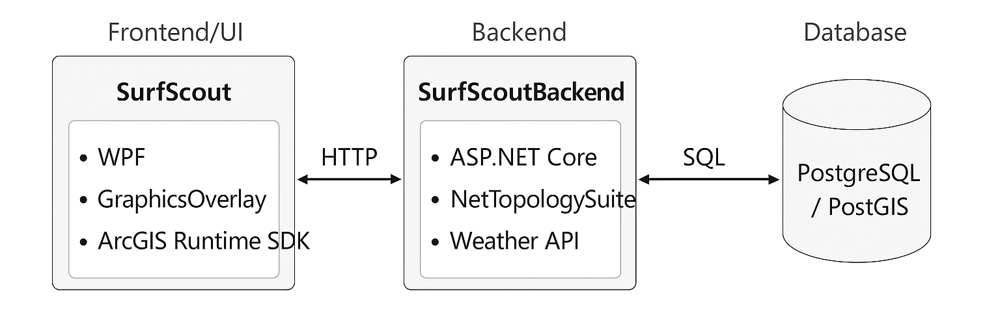
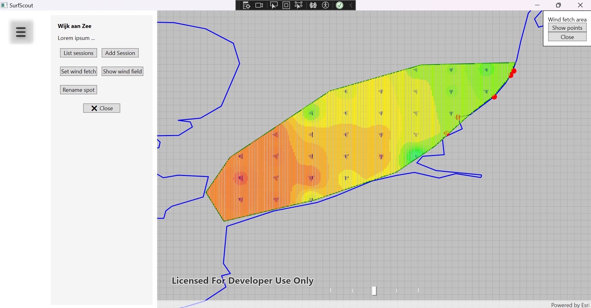

# SurfScout 🌬️🏄‍♂️

**SurfScout** is a work-in-progress analytics tool designed to evaluate windsurfing sessions by visualizing wind fields based on forecast data from weather APIs. The goal is to compare predicted conditions with actual weather observations and derive meaningful insights about session quality — helping users make smarter decisions about future surf spots based on tides and forecast reliability.

## 🔍 Project Goals

- Collect and visualize wind data (raster points) around surf spots
- Store windsurfing sessions enriched with real-time weather data
- Compare weather forecasts with actual conditions and assess accuracy
- Recommend optimal surf locations for future sessions
- Factor **tide levels** into surf spot selection logic
- Determine the **most accurate wind model** for each individual surf spot
- Communicate with a dedicated **SurfScoutBackend**, which manages persistent session data in a **PostgreSQL/PostGIS** geospatial database

> ⚠️ _This project is actively under development. Features, architecture, and visuals are subject to refinement._

## 🛠️ Architecture Overview

- **Frontend/UI**: Built with WPF (Windows Presentation Foundation)
- **Wind Data Visualization**: Uses `GraphicsOverlay` to render raster points on the map
- **GIS Capabilities**: Powered by ArcGIS Runtime SDK for interactive mapping and geometry handling
- **Geometry Operations**: Leverages NetTopologySuite for spatial tasks (e.g. union, intersection)
- **Backend Communication**: Exchanges data via HTTP with the ASP.NET Core–based `SurfScoutBackend`
- **Database Integration**: Session and spot metadata stored in PostgreSQL with PostGIS extension
- **Weather Data Source**: Uses **Stormglass.io** exclusively for marine and wind forecast data

## 📦 Used Frameworks and Libraries

| Framework / Library        | Purpose                                                   |
|---------------------------|------------------------------------------------------------|
| ArcGIS Runtime SDK        | Mapping, geometry capture, and symbol rendering            |
| NetTopologySuite          | Spatial processing (union, intersection, buffering, etc.)  |
| System.Drawing / WPF      | UI rendering, color processing                             |
| Newtonsoft.Json (optional)| JSON parsing for API interactions                          |
| ASP.NET Core Web API      | Backend communication interface                            |
| PostgreSQL + PostGIS      | Persistent storage and geospatial querying of sessions     |
| Stormglass.io             | Marine weather forecasts and wind data                     |

## ✨ Key Features and Outlook

- Map visualization of wind raster points with dynamic styling
- Polygon overlays showing windsurfing sessions by location
- Selective removal or fit of wind fetch areas (illstrated by polygons)
- Comparison between forecast and real-world conditions
- Tide-aware recommendations for surf spots
- Spot-specific forecast model evaluation
- Backend persistence and spatial analysis of session history

## 📍 To Do

- Expand API integration with Stormglass.io data fields
- Improve UI components (e.g. popups, icons, notifications)
- Enable session export/import
- Add backend analytics

## 🖼️ Architecture Overview

> 

_A visual overview showing interaction between the WPF frontend, ASP.NET Core backend, PostgreSQL/PostGIS database._

## 🖼️ Screenshot Examples

> 

> 
